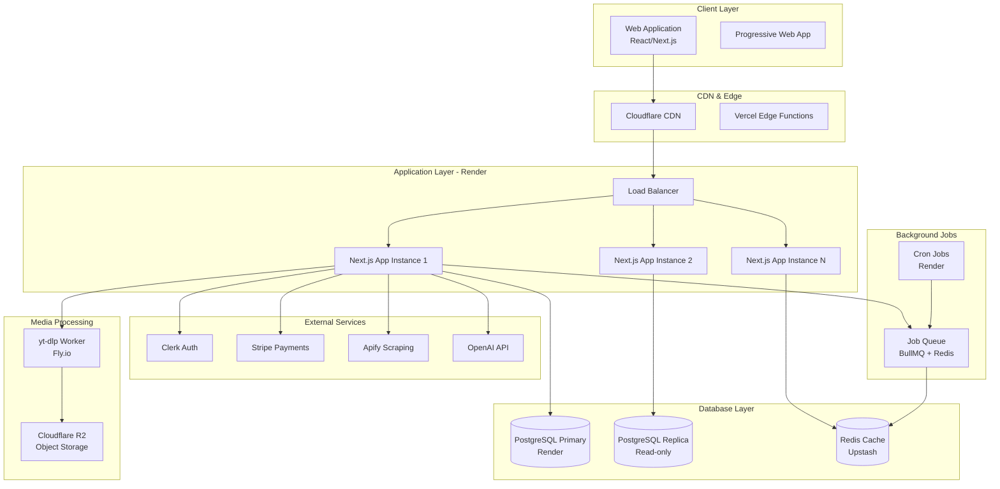
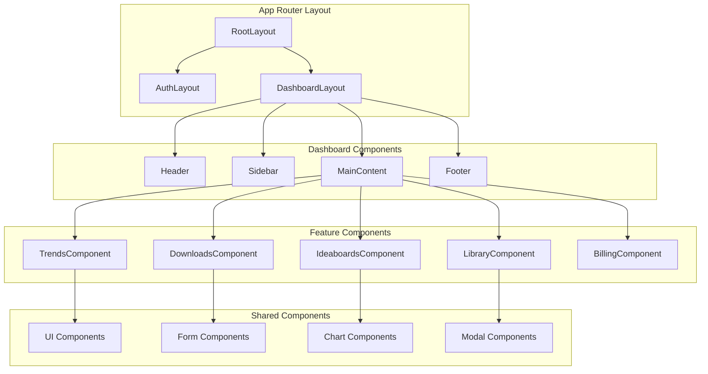

# Kapture - Technical Architecture & Implementation Plan

## 🏗️ Executive Summary

Kapture is architected as a scalable, production-ready Next.js application designed to handle thousands of concurrent users from day one. The architecture leverages modern patterns including separation of concerns, horizontal scaling capabilities, robust caching strategies, and resilient external service integrations.

## 📋 Table of Contents

1. [System Architecture Overview](#system-architecture-overview)
2. [Project Structure](#project-structure)
3. [Database Schema Design](#database-schema-design)
4. [API Architecture](#api-architecture)
5. [Component Hierarchy](#component-hierarchy)
6. [External Service Integrations](#external-service-integrations)
7. [Caching Strategy](#caching-strategy)
8. [Security Architecture](#security-architecture)
9. [Deployment Strategy](#deployment-strategy)
10. [Performance Optimization](#performance-optimization)
11. [Monitoring & Observability](#monitoring--observability)
12. [Implementation Roadmap](#implementation-roadmap)

---

## 🏛️ System Architecture Overview



### Architecture Principles

1. **Horizontal Scalability**: Multi-instance deployment with load balancing
2. **Service Isolation**: External services accessed through dedicated service layers
3. **Caching Strategy**: Multi-layer caching (CDN, Redis, in-memory)
4. **Resilience**: Circuit breakers, retries, and fallback mechanisms
5. **Security**: Zero-trust security model with proper authentication/authorization
6. **Observability**: Comprehensive logging, metrics, and tracing

---

## 📁 Project Structure

```
kapture/
├── README.md
├── next.config.js
├── tailwind.config.js
├── tsconfig.json
├── package.json
├── .env.local
├── .env.example
├── prisma/
│   ├── schema.prisma
│   └── migrations/
├── public/
│   ├── icons/
│   ├── images/
│   └── manifest.json
├── src/
│   ├── app/
│   │   ├── (auth)/
│   │   │   ├── sign-in/
│   │   │   └── sign-up/
│   │   ├── (dashboard)/
│   │   │   ├── dashboard/
│   │   │   ├── trends/
│   │   │   ├── downloads/
│   │   │   ├── ideaboards/
│   │   │   ├── library/
│   │   │   └── settings/
│   │   ├── api/
│   │   │   ├── auth/
│   │   │   ├── stripe/
│   │   │   ├── trends/
│   │   │   ├── downloads/
│   │   │   ├── ai/
│   │   │   ├── library/
│   │   │   ├── cron/
│   │   │   └── webhooks/
│   │   ├── globals.css
│   │   ├── layout.tsx
│   │   ├── page.tsx
│   │   ├── loading.tsx
│   │   ├── error.tsx
│   │   └── not-found.tsx
│   ├── components/
│   │   ├── ui/
│   │   │   ├── button.tsx
│   │   │   ├── card.tsx
│   │   │   ├── input.tsx
│   │   │   ├── modal.tsx
│   │   │   └── ...
│   │   ├── layout/
│   │   │   ├── header.tsx
│   │   │   ├── sidebar.tsx
│   │   │   ├── footer.tsx
│   │   │   └── dashboard-layout.tsx
│   │   ├── features/
│   │   │   ├── auth/
│   │   │   ├── dashboard/
│   │   │   ├── trends/
│   │   │   ├── downloads/
│   │   │   ├── ideaboards/
│   │   │   ├── library/
│   │   │   └── billing/
│   │   └── shared/
│   │       ├── loading-states.tsx
│   │       ├── error-boundaries.tsx
│   │       └── theme-provider.tsx
│   ├── lib/
│   │   ├── auth.ts
│   │   ├── db.ts
│   │   ├── redis.ts
│   │   ├── validation.ts
│   │   ├── constants.ts
│   │   ├── utils.ts
│   │   └── types.ts
│   ├── services/
│   │   ├── auth-service.ts
│   │   ├── billing-service.ts
│   │   ├── trends-service.ts
│   │   ├── downloads-service.ts
│   │   ├── ai-service.ts
│   │   ├── storage-service.ts
│   │   └── notification-service.ts
│   ├── hooks/
│   │   ├── use-auth.ts
│   │   ├── use-subscription.ts
│   │   ├── use-trends.ts
│   │   ├── use-downloads.ts
│   │   └── use-local-storage.ts
│   ├── store/
│   │   ├── auth-store.ts
│   │   ├── ui-store.ts
│   │   ├── trends-store.ts
│   │   └── downloads-store.ts
│   ├── middleware.ts
│   └── types/
│       ├── auth.ts
│       ├── billing.ts
│       ├── trends.ts
│       ├── downloads.ts
│       ├── ai.ts
│       └── database.ts
├── docs/
│   ├── api-documentation.md
│   ├── deployment-guide.md
│   └── development-setup.md
└── scripts/
    ├── build.sh
    ├── deploy.sh
    └── seed-db.ts
```

---

## 🗄️ Database Schema Design

### Core Tables

```sql
-- Users table (synced with Clerk)
CREATE TABLE users (
    id UUID PRIMARY KEY DEFAULT gen_random_uuid(),
    clerk_user_id TEXT UNIQUE NOT NULL,
    email TEXT NOT NULL,
    name TEXT,
    avatar_url TEXT,
    created_at TIMESTAMPTZ DEFAULT NOW(),
    updated_at TIMESTAMPTZ DEFAULT NOW()
);

-- Subscription management
CREATE TABLE user_subscriptions (
    id UUID PRIMARY KEY DEFAULT gen_random_uuid(),
    user_id UUID REFERENCES users(id) ON DELETE CASCADE,
    clerk_user_id TEXT UNIQUE NOT NULL,
    stripe_customer_id TEXT UNIQUE,
    stripe_subscription_id TEXT UNIQUE,
    status TEXT NOT NULL DEFAULT 'inactive',
    price_id TEXT,
    current_period_start TIMESTAMPTZ,
    current_period_end TIMESTAMPTZ,
    created_at TIMESTAMPTZ DEFAULT NOW(),
    updated_at TIMESTAMPTZ DEFAULT NOW()
);

-- Usage tracking
CREATE TABLE user_usage (
    id UUID PRIMARY KEY DEFAULT gen_random_uuid(),
    user_id UUID REFERENCES users(id) ON DELETE CASCADE,
    usage_type TEXT NOT NULL, -- 'scrape', 'download', 'ai_generation'
    count INTEGER DEFAULT 0,
    period_start TIMESTAMPTZ NOT NULL,
    period_end TIMESTAMPTZ NOT NULL,
    created_at TIMESTAMPTZ DEFAULT NOW(),
    updated_at TIMESTAMPTZ DEFAULT NOW(),
    UNIQUE(user_id, usage_type, period_start)
);

-- Trend data
CREATE TABLE trends (
    id UUID PRIMARY KEY DEFAULT gen_random_uuid(),
    user_id UUID REFERENCES users(id) ON DELETE CASCADE,
    platform TEXT NOT NULL, -- 'youtube', 'tiktok', 'reddit', 'twitter'
    content_type TEXT NOT NULL, -- 'video', 'post', 'comment'
    title TEXT,
    description TEXT,
    url TEXT NOT NULL,
    thumbnail_url TEXT,
    author TEXT,
    likes INTEGER DEFAULT 0,
    views INTEGER DEFAULT 0,
    shares INTEGER DEFAULT 0,
    comments INTEGER DEFAULT 0,
    hashtags TEXT[],
    metadata JSONB,
    scraped_at TIMESTAMPTZ NOT NULL,
    created_at TIMESTAMPTZ DEFAULT NOW(),
    updated_at TIMESTAMPTZ DEFAULT NOW()
);

-- Downloaded media
CREATE TABLE media_downloads (
    id UUID PRIMARY KEY DEFAULT gen_random_uuid(),
    user_id UUID REFERENCES users(id) ON DELETE CASCADE,
    trend_id UUID REFERENCES trends(id) ON DELETE SET NULL,
    original_url TEXT NOT NULL,
    storage_url TEXT NOT NULL,
    storage_key TEXT NOT NULL,
    file_type TEXT NOT NULL, -- 'video', 'audio', 'image'
    file_size INTEGER,
    duration INTEGER, -- in seconds for video/audio
    metadata JSONB,
    download_status TEXT DEFAULT 'pending', -- 'pending', 'processing', 'completed', 'failed'
    created_at TIMESTAMPTZ DEFAULT NOW(),
    updated_at TIMESTAMPTZ DEFAULT NOW()
);

-- Ideaboards
CREATE TABLE ideaboards (
    id UUID PRIMARY KEY DEFAULT gen_random_uuid(),
    user_id UUID REFERENCES users(id) ON DELETE CASCADE,
    title TEXT NOT NULL,
    description TEXT,
    content JSONB, -- Rich text content
    tags TEXT[],
    status TEXT DEFAULT 'draft', -- 'draft', 'published', 'archived'
    created_at TIMESTAMPTZ DEFAULT NOW(),
    updated_at TIMESTAMPTZ DEFAULT NOW()
);

-- AI generations
CREATE TABLE ai_generations (
    id UUID PRIMARY KEY DEFAULT gen_random_uuid(),
    user_id UUID REFERENCES users(id) ON DELETE CASCADE,
    ideaboard_id UUID REFERENCES ideaboards(id) ON DELETE CASCADE,
    prompt TEXT NOT NULL,
    response TEXT NOT NULL,
    model TEXT NOT NULL,
    tokens_used INTEGER,
    generation_type TEXT NOT NULL, -- 'title', 'hook', 'script', 'description', 'hashtags'
    created_at TIMESTAMPTZ DEFAULT NOW()
);

-- Background jobs
CREATE TABLE background_jobs (
    id UUID PRIMARY KEY DEFAULT gen_random_uuid(),
    user_id UUID REFERENCES users(id) ON DELETE CASCADE,
    job_type TEXT NOT NULL,
    job_data JSONB NOT NULL,
    status TEXT DEFAULT 'pending', -- 'pending', 'processing', 'completed', 'failed'
    attempts INTEGER DEFAULT 0,
    max_attempts INTEGER DEFAULT 3,
    error_message TEXT,
    scheduled_at TIMESTAMPTZ,
    started_at TIMESTAMPTZ,
    completed_at TIMESTAMPTZ,
    created_at TIMESTAMPTZ DEFAULT NOW(),
    updated_at TIMESTAMPTZ DEFAULT NOW()
);
```

### Indexes for Performance

```sql
-- Performance indexes
CREATE INDEX idx_users_clerk_id ON users(clerk_user_id);
CREATE INDEX idx_subscriptions_user_id ON user_subscriptions(user_id);
CREATE INDEX idx_subscriptions_status ON user_subscriptions(status);
CREATE INDEX idx_usage_user_period ON user_usage(user_id, period_start, period_end);
CREATE INDEX idx_trends_user_platform ON trends(user_id, platform);
CREATE INDEX idx_trends_scraped_at ON trends(scraped_at DESC);
CREATE INDEX idx_downloads_user_status ON media_downloads(user_id, download_status);
CREATE INDEX idx_ideaboards_user_status ON ideaboards(user_id, status);
CREATE INDEX idx_ai_generations_user_type ON ai_generations(user_id, generation_type);
CREATE INDEX idx_jobs_status_scheduled ON background_jobs(status, scheduled_at);
```

---

## 🔗 API Architecture

### REST API Endpoints

```typescript
// Authentication & User Management
GET    /api/auth/user                    // Get current user info
POST   /api/auth/sync                    // Sync Clerk user with database
DELETE /api/auth/user                    // Delete user account

// Billing & Subscriptions
GET    /api/billing/subscription         // Get user subscription
POST   /api/billing/checkout             // Create Stripe checkout session
POST   /api/billing/portal               // Create customer portal session
GET    /api/billing/usage                // Get current usage stats
POST   /api/webhooks/stripe              // Stripe webhook handler

// Trends & Scraping
GET    /api/trends                       // Get user's trends
POST   /api/trends/scrape                // Trigger scraping job
GET    /api/trends/[id]                  // Get specific trend
DELETE /api/trends/[id]                  // Delete trend
POST   /api/trends/bulk-scrape           // Bulk scraping operation

// Media Downloads
GET    /api/downloads                    // Get user's downloads
POST   /api/downloads/request            // Request media download
GET    /api/downloads/[id]               // Get download status
DELETE /api/downloads/[id]               // Delete downloaded media
POST   /api/downloads/bulk               // Bulk download request

// AI Generation
POST   /api/ai/generate                  // Generate AI content
GET    /api/ai/generations               // Get user's AI generations
POST   /api/ai/ideaboard                 // AI-powered ideaboard creation

// Ideaboards
GET    /api/ideaboards                   // Get user's ideaboards
POST   /api/ideaboards                   // Create new ideaboard
GET    /api/ideaboards/[id]              // Get specific ideaboard
PUT    /api/ideaboards/[id]              // Update ideaboard
DELETE /api/ideaboards/[id]              // Delete ideaboard

// Content Library
GET    /api/library                      // Get user's content library
GET    /api/library/search               // Search library content
POST   /api/library/organize             // Organize library content

// Background Jobs
GET    /api/jobs                         // Get user's job status
POST   /api/jobs/cancel                  // Cancel running job

// Cron Jobs
POST   /api/cron/scrape-trends           // Scheduled trend scraping
POST   /api/cron/cleanup-media           // Media cleanup
POST   /api/cron/usage-reset             // Reset monthly usage
```

### API Response Patterns

```typescript
// Standard API Response Interface
interface APIResponse<T> {
  success: boolean;
  data?: T;
  error?: {
    code: string;
    message: string;
    details?: any;
  };
  meta?: {
    pagination?: {
      page: number;
      limit: number;
      total: number;
      totalPages: number;
    };
    usage?: {
      current: number;
      limit: number;
      remaining: number;
    };
  };
}

// Error Response Codes
enum APIErrorCode {
  UNAUTHORIZED = 'UNAUTHORIZED',
  FORBIDDEN = 'FORBIDDEN',
  NOT_FOUND = 'NOT_FOUND',
  VALIDATION_ERROR = 'VALIDATION_ERROR',
  RATE_LIMITED = 'RATE_LIMITED',
  USAGE_EXCEEDED = 'USAGE_EXCEEDED',
  EXTERNAL_SERVICE_ERROR = 'EXTERNAL_SERVICE_ERROR',
  INTERNAL_SERVER_ERROR = 'INTERNAL_SERVER_ERROR'
}
```

---

## 🧱 Component Hierarchy

### Application Structure



### State Management Architecture

```typescript
// Global State with Zustand
interface AppState {
  // Auth state
  user: User | null;
  subscription: Subscription | null;
  usage: UsageStats | null;
  
  // UI state
  theme: 'light' | 'dark';
  sidebarOpen: boolean;
  
  // Feature state
  trends: Trend[];
  downloads: Download[];
  ideaboards: Ideaboard[];
  
  // Actions
  setUser: (user: User) => void;
  setSubscription: (subscription: Subscription) => void;
  updateUsage: (usage: UsageStats) => void;
  toggleTheme: () => void;
  toggleSidebar: () => void;
}
```

---

## 🔌 External Service Integrations

### Service Integration Patterns

```typescript
// Base Service Class
abstract class BaseService {
  protected baseURL: string;
  protected apiKey: string;
  protected timeout: number = 30000;
  
  constructor(baseURL: string, apiKey: string) {
    this.baseURL = baseURL;
    this.apiKey = apiKey;
  }
  
  protected async request<T>(
    endpoint: string, 
    options: RequestOptions
  ): Promise<T> {
    // Implement retry logic, circuit breaker, and error handling
  }
}

// Apify Service
class ApifyService extends BaseService {
  async scrapeYouTube(params: YouTubeScrapeParams): Promise<YouTubeData[]> {
    return this.request('/acts/youtube-scraper/runs', {
      method: 'POST',
      body: JSON.stringify(params)
    });
  }
  
  async scrapeTikTok(params: TikTokScrapeParams): Promise<TikTokData[]> {
    return this.request('/acts/tiktok-scraper/runs', {
      method: 'POST',
      body: JSON.stringify(params)
    });
  }
}

// Media Download Service (yt-dlp on Fly.io)
class MediaDownloadService extends BaseService {
  async downloadMedia(url: string, options: DownloadOptions): Promise<DownloadJob> {
    return this.request('/download', {
      method: 'POST',
      body: JSON.stringify({ url, options })
    });
  }
  
  async getDownloadStatus(jobId: string): Promise<DownloadStatus> {
    return this.request(`/download/${jobId}/status`, {
      method: 'GET'
    });
  }
}

// OpenAI Service
class AIService extends BaseService {
  async generateContent(prompt: string, type: GenerationType): Promise<string> {
    return this.request('/chat/completions', {
      method: 'POST',
      body: JSON.stringify({
        model: 'gpt-4',
        messages: [{ role: 'user', content: prompt }],
        temperature: 0.7
      })
    });
  }
}
```

### Circuit Breaker Implementation

```typescript
class CircuitBreaker {
  private failureCount = 0;
  private lastFailureTime = 0;
  private state: 'CLOSED' | 'OPEN' | 'HALF_OPEN' = 'CLOSED';
  
  constructor(
    private failureThreshold: number = 5,
    private timeout: number = 60000
  ) {}
  
  async execute<T>(operation: () => Promise<T>): Promise<T> {
    if (this.state === 'OPEN') {
      if (Date.now() - this.lastFailureTime > this.timeout) {
        this.state = 'HALF_OPEN';
      } else {
        throw new Error('Circuit breaker is OPEN');
      }
    }
    
    try {
      const result = await operation();
      this.onSuccess();
      return result;
    } catch (error) {
      this.onFailure();
      throw error;
    }
  }
  
  private onSuccess() {
    this.failureCount = 0;
    this.state = 'CLOSED';
  }
  
  private onFailure() {
    this.failureCount++;
    this.lastFailureTime = Date.now();
    
    if (this.failureCount >= this.failureThreshold) {
      this.state = 'OPEN';
    }
  }
}
```

---

## 💾 Caching Strategy

### Multi-Layer Caching Architecture

```typescript
// Cache Layer Interface
interface CacheLayer {
  get<T>(key: string): Promise<T | null>;
  set<T>(key: string, value: T, ttl?: number): Promise<void>;
  delete(key: string): Promise<void>;
  clear(): Promise<void>;
}

// Redis Cache Implementation
class RedisCache implements CacheLayer {
  private redis: Redis;
  
  constructor(redisUrl: string) {
    this.redis = new Redis(redisUrl);
  }
  
  async get<T>(key: string): Promise<T | null> {
    const value = await this.redis.get(key);
    return value ? JSON.parse(value) : null;
  }
  
  async set<T>(key: string, value: T, ttl = 3600): Promise<void> {
    await this.redis.setex(key, ttl, JSON.stringify(value));
  }
  
  async delete(key: string): Promise<void> {
    await this.redis.del(key);
  }
  
  async clear(): Promise<void> {
    await this.redis.flushall();
  }
}

// Cache Strategy
class CacheManager {
  private layers: CacheLayer[] = [];
  
  addLayer(layer: CacheLayer) {
    this.layers.push(layer);
  }
  
  async get<T>(key: string): Promise<T | null> {
    for (const layer of this.layers) {
      const value = await layer.get<T>(key);
      if (value !== null) {
        // Backfill lower layers
        await this.backfill(key, value);
        return value;
      }
    }
    return null;
  }
  
  async set<T>(key: string, value: T, ttl?: number): Promise<void> {
    // Set in all layers
    await Promise.all(
      this.layers.map(layer => layer.set(key, value, ttl))
    );
  }
  
  private async backfill<T>(key: string, value: T): Promise<void> {
    // Backfill layers that didn't have the value
    // Implementation details...
  }
}
```

### Cache Keys and TTL Strategy

```typescript
// Cache Key Patterns
const CACHE_KEYS = {
  USER_SUBSCRIPTION: (userId: string) => `user:${userId}:subscription`,
  USER_USAGE: (userId: string, period: string) => `user:${userId}:usage:${period}`,
  TRENDS: (userId: string, platform: string) => `trends:${userId}:${platform}`,
  DOWNLOAD_STATUS: (jobId: string) => `download:${jobId}:status`,
  AI_GENERATION: (prompt: string) => `ai:${hashPrompt(prompt)}`,
} as const;

// TTL Configuration
const CACHE_TTL = {
  USER_SUBSCRIPTION: 300, // 5 minutes
  USER_USAGE: 60, // 1 minute
  TRENDS: 900, // 15 minutes
  DOWNLOAD_STATUS: 30, // 30 seconds
  AI_GENERATION: 3600, // 1 hour
} as const;
```

---

## 🔒 Security Architecture

### Authentication & Authorization

```typescript
// Middleware for API Route Protection
export function withAuth(handler: NextApiHandler) {
  return async (req: NextApiRequest, res: NextApiResponse) => {
    try {
      const { userId } = auth();
      if (!userId) {
        return res.status(401).json({ error: 'Unauthorized' });
      }
      
      // Add user to request context
      req.user = await getUserById(userId);
      return handler(req, res);
    } catch (error) {
      return res.status(401).json({ error: 'Invalid token' });
    }
  };
}

// Rate Limiting
export function withRateLimit(
  limit: number = 100,
  window: number = 60000
) {
  return (handler: NextApiHandler) => {
    return async (req: NextApiRequest, res: NextApiResponse) => {
      const identifier = req.ip || req.headers['x-forwarded-for'] || 'anonymous';
      const isAllowed = await checkRateLimit(identifier, limit, window);
      
      if (!isAllowed) {
        return res.status(429).json({ error: 'Rate limit exceeded' });
      }
      
      return handler(req, res);
    };
  };
}

// Usage Quota Validation
export function withUsageValidation(usageType: UsageType) {
  return (handler: NextApiHandler) => {
    return async (req: NextApiRequest, res: NextApiResponse) => {
      const user = req.user;
      const usage = await getUserUsage(user.id, usageType);
      const limit = await getUsageLimit(user.subscriptionTier, usageType);
      
      if (usage >= limit) {
        return res.status(403).json({ 
          error: 'Usage limit exceeded',
          code: 'USAGE_EXCEEDED'
        });
      }
      
      return handler(req, res);
    };
  };
}
```

### Data Validation & Sanitization

```typescript
// Input Validation with Zod
const trendScrapeSchema = z.object({
  platform: z.enum(['youtube', 'tiktok', 'reddit', 'twitter']),
  keywords: z.array(z.string().min(1).max(100)).min(1).max(10),
  limit: z.number().min(1).max(100).default(10),
  filters: z.object({
    dateRange: z.enum(['1d', '7d', '30d']).optional(),
    minViews: z.number().min(0).optional(),
    language: z.string().optional(),
  }).optional(),
});

// API Route with Validation
export async function POST(request: Request) {
  try {
    const body = await request.json();
    const validatedData = trendScrapeSchema.parse(body);
    
    // Process validated data
    const trends = await scrapeTrends(validatedData);
    
    return NextResponse.json({ success: true, data: trends });
  } catch (error) {
    if (error instanceof z.ZodError) {
      return NextResponse.json(
        { success: false, error: { code: 'VALIDATION_ERROR', details: error.errors } },
        { status: 400 }
      );
    }
    throw error;
  }
}
```

---

## 🚀 Deployment Strategy

### Production Deployment Architecture

```yaml
# render.yaml
services:
  - type: web
    name: kapture-web
    env: node
    buildCommand: npm run build
    startCommand: npm start
    envVars:
      - key: NODE_ENV
        value: production
      - key: DATABASE_URL
        fromDatabase:
          name: kapture-db
          property: connectionString
    scaling:
      minInstances: 2
      maxInstances: 10
      targetCPUPercent: 70
      targetMemoryPercent: 80
    
  - type: cron
    name: trend-scraper
    schedule: "0 */4 * * *" # Every 4 hours
    buildCommand: npm run build
    startCommand: npm run cron:scrape-trends
    
  - type: cron
    name: usage-reset
    schedule: "0 0 1 * *" # First day of each month
    buildCommand: npm run build
    startCommand: npm run cron:reset-usage

databases:
  - name: kapture-db
    databaseName: kapture
    user: kapture
    plan: standard
```

### Fly.io yt-dlp Worker Deployment

```dockerfile
# Dockerfile for yt-dlp worker
FROM python:3.11-slim

WORKDIR /app

# Install system dependencies
RUN apt-get update && apt-get install -y \
    ffmpeg \
    curl \
    && rm -rf /var/lib/apt/lists/*

# Install Python dependencies
COPY requirements.txt .
RUN pip install --no-cache-dir -r requirements.txt

# Copy application code
COPY . .

EXPOSE 8080

CMD ["python", "app.py"]
```

```toml
# fly.toml
app = "kapture-media-worker"
primary_region = "ord"

[build]
  dockerfile = "Dockerfile"

[env]
  PORT = "8080"

[[services]]
  http_checks = []
  internal_port = 8080
  processes = ["app"]
  protocol = "tcp"
  script_checks = []
  
  [services.concurrency]
    hard_limit = 25
    soft_limit = 20
    type = "connections"

  [[services.ports]]
    force_https = true
    handlers = ["http"]
    port = 80

  [[services.ports]]
    handlers = ["tls", "http"]
    port = 443

[scaling]
  min_machines = 2
  max_machines = 10
```

---

## ⚡ Performance Optimization

### Database Optimization

```sql
-- Connection Pooling Configuration
-- pg_bouncer.ini
[databases]
kapture = host=localhost port=5432 dbname=kapture

[pgbouncer]
listen_port = 6432
listen_addr = 0.0.0.0
auth_type = md5
auth_file = /etc/pgbouncer/userlist.txt
pool_mode = transaction
max_client_conn = 200
default_pool_size = 20
max_db_connections = 100
```

### Frontend Optimization

```typescript
// Lazy Loading and Code Splitting
const TrendsComponent = lazy(() => import('@/components/features/trends/TrendsComponent'));
const DownloadsComponent = lazy(() => import('@/components/features/downloads/DownloadsComponent'));
const IdeaboardsComponent = lazy(() => import('@/components/features/ideaboards/IdeaboardsComponent'));

// Image Optimization
import Image from 'next/image';

const OptimizedImage = ({ src, alt, ...props }) => (
  <Image
    src={src}
    alt={alt}
    loading="lazy"
    placeholder="blur"
    blurDataURL="data:image/jpeg;base64,/9j/4AAQSkZJRgABAQAAAQABAAD/2wBDAAYEBQYFBAYGBQYHBwYIChAKCgkJChQODwwQFxQYGBcUFhYaHSUfGhsjHBYWICwgIyYnKSopGR8tMC0oMCUoKSj/2wBDAQcHBwoIChMKChMoGhYaKCgoKCgoKCgoKCgoKCgoKCgoKCgoKCgoKCgoKCgoKCgoKCgoKCgoKCgoKCgoKCgoKCj/wAARCAAIAAoDASIAAhEBAxEB/8QAFQABAQAAAAAAAAAAAAAAAAAAAAv/xAAhEAACAQMDBQAAAAAAAAAAAAABAgMABAUGIWGRkqGx0f/EABUBAQEAAAAAAAAAAAAAAAAAAAMF/8QAGhEAAgIDAAAAAAAAAAAAAAAAAAECEgMRkf/aAAwDAQACEQMRAD8AltJagyeH0AthI5xdrLcNM91BF5pX2HaH9bcfaSXWGaRmknyJckliyjqTzSlT54b6bk+h0R//2Q=="
    {...props}
  />
);

// Virtual Scrolling for Large Lists
import { FixedSizeList as List } from 'react-window';

const VirtualizedTrendsList = ({ trends }) => (
  <List
    height={600}
    itemCount={trends.length}
    itemSize={120}
    itemData={trends}
  >
    {({ index, style, data }) => (
      <div style={style}>
        <TrendCard trend={data[index]} />
      </div>
    )}
  </List>
);
```

---

## 📊 Monitoring & Observability

### Logging Strategy

```typescript
// Structured Logging with Winston
import winston from 'winston';

const logger = winston.createLogger({
  level: process.env.LOG_LEVEL || 'info',
  format: winston.format.combine(
    winston.format.timestamp(),
    winston.format.errors({ stack: true }),
    winston.format.json()
  ),
  defaultMeta: { service: 'kapture-api' },
  transports: [
    new winston.transports.File({ filename: 'logs/error.log', level: 'error' }),
    new winston.transports.File({ filename: 'logs/combined.log' }),
    new winston.transports.Console({
      format: winston.format.simple()
    })
  ]
});

// Usage Tracking
export async function trackUsage(
  userId: string,
  usageType: UsageType,
  amount: number = 1
) {
  try {
    await incrementUsage(userId, usageType, amount);
    
    logger.info('Usage tracked', {
      userId,
      usageType,
      amount,
      timestamp: new Date().toISOString()
    });
  } catch (error) {
    logger.error('Failed to track usage', {
      userId,
      usageType,
      amount,
      error: error.message,
      stack: error.stack
    });
  }
}
```

### Health Checks

```typescript
// Health Check Endpoint
export async function GET() {
  const checks = {
    database: await checkDatabase(),
    redis: await checkRedis(),
    stripe: await checkStripe(),
    apify: await checkApify(),
    openai: await checkOpenAI(),
  };
  
  const isHealthy = Object.values(checks).every(check => check.status === 'healthy');
  
  return NextResponse.json(
    {
      status: isHealthy ? 'healthy' : 'unhealthy',
      timestamp: new Date().toISOString(),
      checks
    },
    { status: isHealthy ? 200 : 503 }
  );
}

async function checkDatabase(): Promise<HealthCheck> {
  try {
    await db.query('SELECT 1');
    return { status: 'healthy', responseTime: Date.now() };
  } catch (error) {
    return { status: 'unhealthy', error: error.message };
  }
}
```

---

## 🗺️ Implementation Roadmap

### Phase 1: Foundation (Weeks 1-3)

**Week 1: Project Setup & Core Infrastructure**
- [ ] Initialize Next.js project with TypeScript
- [ ] Set up database schema and migrations
- [ ] Configure Clerk authentication
- [ ] Implement basic UI components and design system
- [ ] Set up Redis caching layer

**Week 2: User Management & Billing**
- [ ] Implement user registration/login flows
- [ ] Set up Stripe integration and webhook handlers
- [ ] Create subscription management system
- [ ] Implement usage tracking and quota enforcement
- [ ] Build billing dashboard

**Week 3: Core API & Security**
- [ ] Develop API route structure
- [ ] Implement authentication middleware
- [ ] Add rate limiting and security measures
- [ ] Create error handling and logging system
- [ ] Set up monitoring and health checks

### Phase 2: Trend Scraping (Weeks 4-6)

**Week 4: Apify Integration**
- [ ] Set up Apify service integration
- [ ] Implement YouTube scraping functionality
- [ ] Add TikTok scraping capabilities
- [ ] Create background job processing system

**Week 5: Multi-Platform Scraping**
- [ ] Add Reddit scraping integration
- [ ] Implement Twitter/X scraping
- [ ] Build trend aggregation and deduplication
- [ ] Create scheduled scraping jobs

**Week 6: Trend Management**
- [ ] Build trends dashboard UI
- [ ] Implement trend filtering and search
- [ ] Add trend categorization and tagging
- [ ] Create trend analytics and insights

### Phase 3: Media Downloads (Weeks 7-9)

**Week 7: yt-dlp Worker Setup**
- [ ] Deploy yt-dlp worker on Fly.io
- [ ] Implement proxy rotation system
- [ ] Set up Cloudflare R2 storage integration
- [ ] Create download job queue system

**Week 8: Download Management**
- [ ] Build download request API
- [ ] Implement download status tracking
- [ ] Add download progress monitoring
- [ ] Create download history and management UI

**Week 9: Media Processing**
- [ ] Add media format conversion
- [ ] Implement thumbnail generation
- [ ] Add metadata extraction
- [ ] Create media organization system

### Phase 4: AI Integration (Weeks 10-12)

**Week 10: OpenAI Integration**
- [ ] Set up OpenAI API integration
- [ ] Implement prompt engineering system
- [ ] Create AI generation endpoints
- [ ] Add generation history tracking

**Week 11: Ideaboards**
- [ ] Build ideaboard creation system
- [ ] Implement rich text editor
- [ ] Add AI-assisted content generation
- [ ] Create ideaboard sharing features

**Week 12: AI Enhancement**
- [ ] Implement context-aware generation
- [ ] Add custom prompt templates
- [ ] Create AI generation analytics
- [ ] Optimize AI usage and costs

### Phase 5: Content Library (Weeks 13-15)

**Week 13: Library Foundation**
- [ ] Build content library database structure
- [ ] Implement content indexing system
- [ ] Create search and filtering capabilities
- [ ] Add content categorization

**Week 14: Library Features**
- [ ] Build content library UI
- [ ] Implement bulk operations
- [ ] Add content tagging system
- [ ] Create content recommendation engine

**Week 15: Advanced Features**
- [ ] Add content collaboration features
- [ ] Implement export functionality
- [ ] Create content analytics
- [ ] Add content backup system

### Phase 6: Optimization & Launch (Weeks 16-18)

**Week 16: Performance Optimization**
- [ ] Optimize database queries
- [ ] Implement advanced caching strategies
- [ ] Add CDN integration
- [ ] Optimize bundle size and loading

**Week 17: Testing & Quality Assurance**
- [ ] Implement comprehensive test suite
- [ ] Perform load testing
- [ ] Security audit and penetration testing
- [ ] User acceptance testing

**Week 18: Production Deployment**
- [ ] Set up production environment
- [ ] Configure monitoring and alerting
- [ ] Implement backup and disaster recovery
- [ ] Launch and monitor initial users

### Phase 7: Post-Launch Enhancements (Weeks 19-24)

**Weeks 19-20: User Feedback Integration**
- [ ] Gather and analyze user feedback
- [ ] Fix critical bugs and issues
- [ ] Implement requested features
- [ ] Optimize user experience

**Weeks 21-22: Advanced Features**
- [ ] Add team collaboration features
- [ ] Implement advanced analytics
- [ ] Create mobile-responsive enhancements
- [ ] Add integration with social platforms

**Weeks 23-24: Scaling Preparation**
- [ ] Implement advanced monitoring
- [ ] Optimize for higher user loads
- [ ] Add advanced security features
- [ ] Prepare for feature scaling

---

## 🎯 Success Metrics & KPIs

### Technical Metrics
- **Performance**: API response time < 200ms (95th percentile)
- **Availability**: 99.9% uptime
- **Scalability**: Handle 10,000+ concurrent users
- **Error Rate**: < 0.1% error rate

### Business Metrics
- **User Engagement**: Daily active users
- **Feature Adoption**: Trends scraped, Downloads completed, AI generations
- **Revenue**: Monthly recurring revenue growth
- **Retention**: User retention rates by cohort

---

## 📝 Conclusion

This architecture provides a solid foundation for Kapture that can scale from thousands to hundreds of thousands of users. The modular design allows for incremental development and deployment, while the comprehensive monitoring and caching strategies ensure optimal performance.

Key architectural decisions:
1. **Microservices-oriented design** for external service integration
2. **Multi-layer caching** for optimal performance
3. **Horizontal scaling** capabilities from day one
4. **Comprehensive monitoring** and observability
5. **Security-first approach** with proper authentication and authorization

The implementation roadmap provides a clear path to launch, with each phase building upon the previous one to create a robust, scalable platform for content creators.